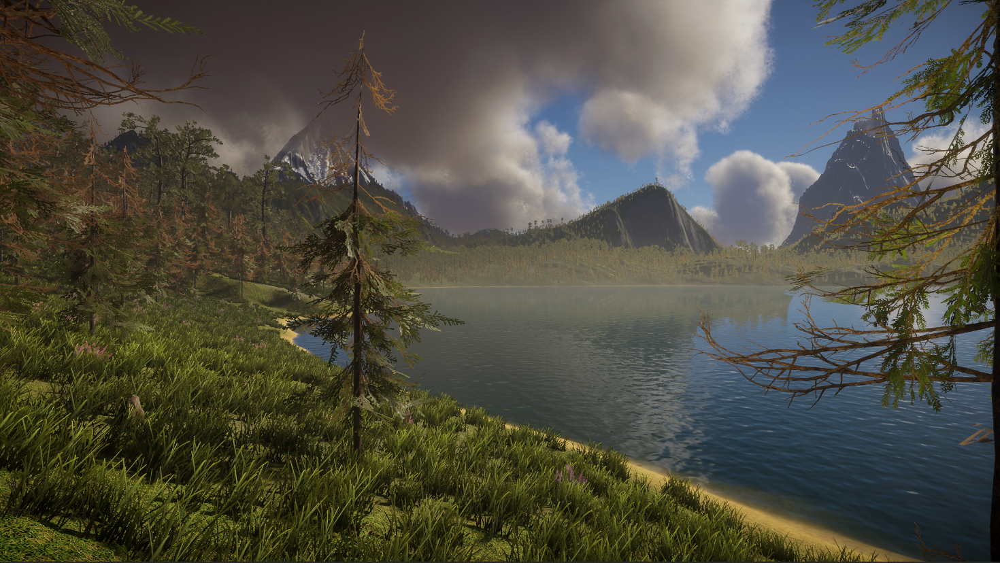
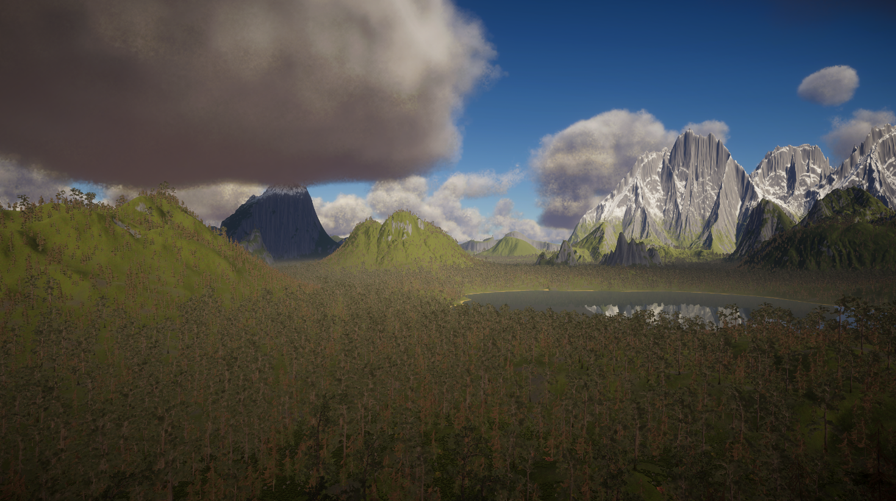

# 🌲 Into The Wilds

**Into The Wilds** is a large-scale open environment project built in Unity, focused on demonstrating advanced rendering and optimization techniques for massive worlds.

The core goal of this project is not gameplay, but **pushing performance limits** while maintaining visual quality in a dense, natural environment.

---

## 📸 Preview

---

## 🚀 Key Features

### 🌍 Massive World
- 11 × 11 terrain tiles
- **121 km² total area**
- Seamless large-scale environment

### 🌿 Advanced Vegetation Rendering
- GPU instancing with **indirect draw calls**
- Supports **hundreds of thousands of instances**
- Custom vegetation rendering system
- LOD based terrain detail

### 👁️ Dynamic Occlusion Culling
- Per-instance vegetation culling
- Reduces overdraw and unnecessary rendering
- Optimized for dense environments

### 💾 Terrain Data Streaming
- Terrain detail data:
    - **Baked into binary format**
    - Stored in `StreamingAssets`
    - Streamed efficiently at runtime
- Minimizes memory usage and load times

### 🌲 Impostor System
- **16-axis octahedral impostors**
- Used for trees and distant details
- Significant reduction in polygon count

### 🎨 HDRP Rendering
- Built using Unity **HDRP**
- High-quality lighting, atmosphere, and reflections

---

## ⚡ Performance

**Tested on:**
- GPU: RTX 4060
- Resolution: 2560×1440 (2K)

**Average Performance:**
- 🟢 60–90 FPS

---

## 🧠 Technical Focus

This project demonstrates:

- GPU-driven rendering
- Efficient memory management
- Large world streaming systems
- Scalable vegetation rendering
